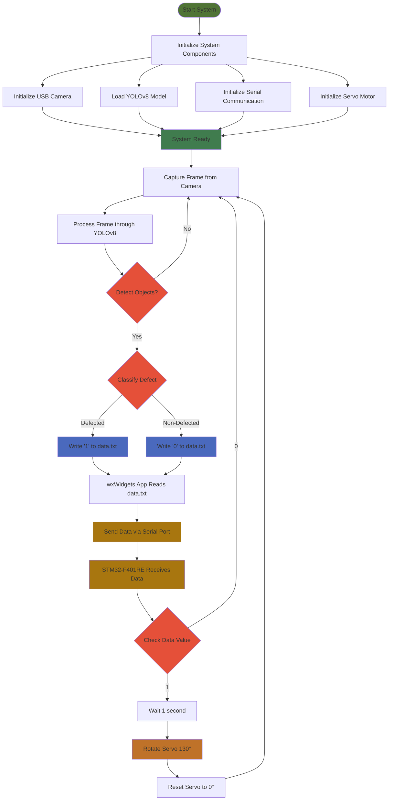

# Automated-Visual-Defect-Detection-Removal-System-for-Tablets

The system uses machine learning, real-time communication, and embedded systems to perform defect detection and physical removal of defective tablets (specifically DOLO-650). This project demonstrates a prototype for the integration of computer vision, microcontroller programming, and mechanical design for a complete automated manufacturing solution.


I have integrated a custom YOLOv8 model for visual inspection. The system is designed to detect any defects in tablets moving along a conveyor belt and immediately remove the defective ones using a servo motor controlled by an STM32-F401RE microcontroller. Established serial communication between the microcontroller and a wxWidgets application (to send data from computer to STM32-F401RE via USB port), allowing for real-time defect logging and management.

#### Video Demo

https://github.com/user-attachments/assets/bc851247-ee02-4825-903a-e4b063f14a0a


## Technologies Used
* **Machine Learning**: YOLOv8 (Ultralytics) for building the defect detection model.
* **Programming Languages**: Python (for ML inference), C++ (Arduino code for STM32-F401RE microcontroller), wxWidgets (C++ for GUI and serial communication).
* **Embedded System**: STM32-F401RE microcontroller for controlling the servo motor.
* **Hardware**:
    * Conveyor system where tablet moves, built with wooden planks, wheels, DC motor, elastic belt...
    * USB camera for real-time image capture
    * Servo motor for physical removal of defective tablets.

## Workflow
These steps represent the approach I followed to implement the system. However, other approaches or variations in hardware, software, and communication methods may also be used to achieve similar functionality.

### 1.  Dataset Creation
* I used [Google's Teachable Machine](https://teachablemachine.withgoogle.com/train/) to capture images with three classes:
    * No-defect (normal tablets)
    * Defected (damaged tablets)
    * Background (null category)
    
    and uploaded these images to Roboflow.
* Performed annotation, labeling, augmentation, and preprocessing on Roboflow. For all these steps I followed this [tutorial](https://youtu.be/wuZtUMEiKWY?si=PZ66WE1yqIztybXL).
* Dataset size: 11,832 images. The dataset can be accessed [here](https://universe.roboflow.com/fyp-qjwy0/tablet-defect-detection-er87f) by anyone.
* Then exported the dataset and loaded it into Google Colab for training.

### 2.  Model Training & Exporting
* Trained the custom YOLOv8 model on Google Colab using the Ultralytics YOLOv8 framework. You can check out the code at [`defect_detection1.ipynb`](https://github.com/chirag-000/Automated-Visual-Defect-Detection-and-Removal-System-for-Tablets/blob/main/defect_detection1.ipynb). I followed the same [tutorial](https://youtu.be/wuZtUMEiKWY?si=PZ66WE1yqIztybXL) mentioned above.
* Achieved 99.2% mAP (Mean Average Precision), in this [model](https://universe.roboflow.com/fyp-qjwy0/tablet-defect-detection-er87f/model/3).
* Exported the trained [model (`best.pt`)](https://github.com/chirag-000/Automated-Visual-Defect-Detection-and-Removal-System-for-Tablets/blob/main/best.pt). Which can be done [this way](https://youtu.be/WbomGeoOT_k?t=20&si=TR5ZRDD82689muMX).

### 3. Environment Setup

You can follow these steps to run inference on this model: <br>
Assuming you have anaconda3 installed just import this [`environment.yml`](https://github.com/chirag-000/Automated-Visual-Defect-Detection-and-Removal-System-for-Tablets/blob/main/environment.yml) file to a new environment. <br>
Or follow any tutorial like [this](https://youtu.be/IHbJcOex6dk?t=318&si=qtvQ1Dr2ayxCmYeS), to run the model on your computer.

### 4. Real-Time Defect Detection
Launch VSCode in the conda env, and run this Python script ([`script.py`](https://github.com/chirag-000/Automated-Visual-Defect-Detection-and-Removal-System-for-Tablets/blob/main/script.py)) to:
* Load the YOLOv8 model and run inference.
* Write detection results (1 for defected, 0 for non-defected) to data.txt.
* Added a 1-second delay before writing to avoid redundant detections.
```python
from ultralytics import YOLO
import time

# Load model
model = YOLO('best.pt')

# Run inference with streaming
results = model(source=0, show=True, conf=0.6, save=True, stream=True)

# Process results
for result in results:
    # For each detection, get class names and write to file
    if result.boxes:  # Check if there are any detections
        with open("C:/Chirag/data.txt", "w") as file:  # Use write mode
            for box in result.boxes:
                class_name = result.names[int(box.cls)]
                if class_name == "defected": 
                    file.write("1\n") 
                else: 
                    file.write("0\n")
        time.sleep(1) # Introduce a delay
```
#### Process Flowchart:
Untill now we have implemented upto writing the predictions to the `data.txt` file, now this data should be sent to the STM32-F401RE via serial port to control the servo motor action accordingly, which is explained in the upcoming steps



### 5. Communication with STM32-F401RE Microcontroller
The wxWidgets application running on the computer continuously reads the `data.txt` file and sends the prediction data (0 or 1) via serial communication to the microcontroller. <br>

To run this application open `waArduinoSerialGUI` in the [`lib`](https://github.com/chirag-000/Automated-Visual-Defect-Detection-and-Removal-System-for-Tablets/blob/main/lib.7z) folder and select the port after connecting STM32-F401RE to the computer via USB cable. Make sure the `waArduinoSerialGUI` application and all the other files in `lib` folder are in the same folder. <br>

**wxWidgets GUI Application**
* File: [`main.cpp`](https://github.com/chirag-000/Automated-Visual-Defect-Detection-and-Removal-System-for-Tablets/blob/main/main.cpp)
* Purpose: Serial communication with STM32-F401RE using wxWidgets app
* Key Features:
    * Select serial port.
    * Read data.txt for defect detection results.
    * Send defect information to STM32-F401RE via Serial.

**Serial Communication Logic**
* File: [`serial.cpp`](https://github.com/chirag-000/Automated-Visual-Defect-Detection-and-Removal-System-for-Tablets/blob/main/serial.cpp)
* Purpose: Manages serial port connections and communication.
* Key Features:
    * Detects available COM ports.
    * Reads data.txt only if modified.
    * Sends data (1 or 0) to STM32-F401RE via serial communication.

### 6. Defect Removal Mechanism (STM32-F401RE & Servo Motor Control)
[`Arduino C++ program`](https://github.com/chirag-000/Automated-Visual-Defect-Detection-and-Removal-System-for-Tablets/blob/main/servomotor.cpp) flashed to the STM32-F401RE microcontroller to:
* Read data from the serial port and control the servo motor based on received data.
* If a defect (1) is detected:
    * Wait 1 second to sync with conveyor motion.
    * Rotate the servo motor by 130° to push the defective tablet off the belt.
    * Return to default (0°) position.
* If no defect (0), no action is taken.
